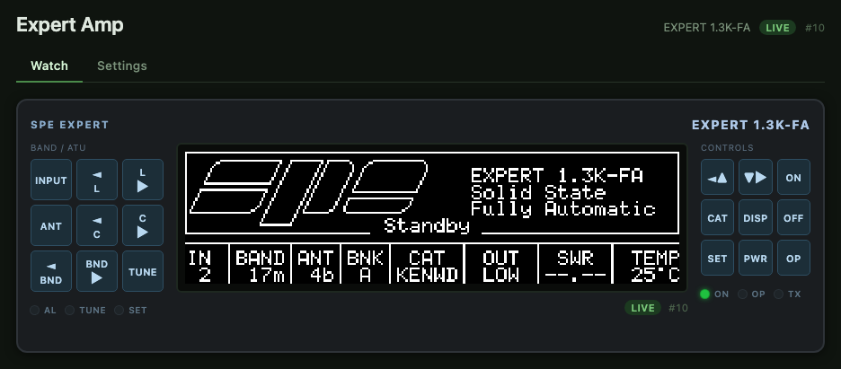
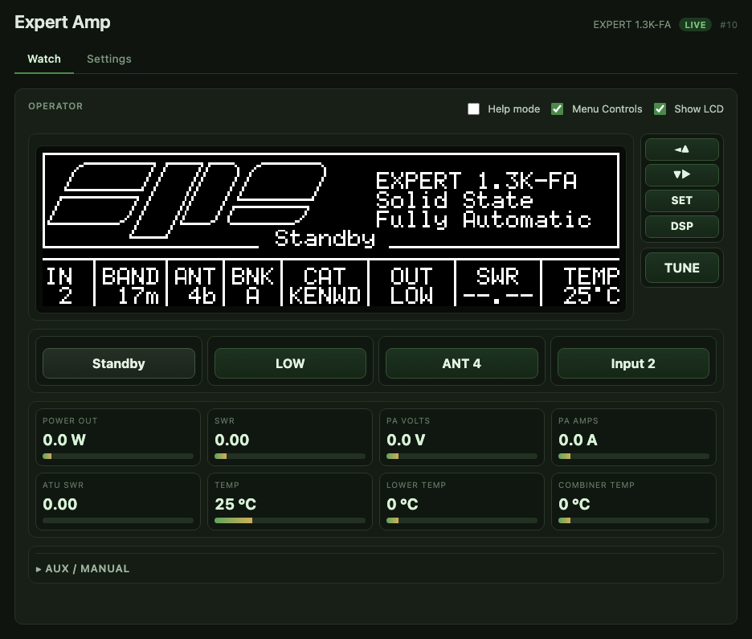
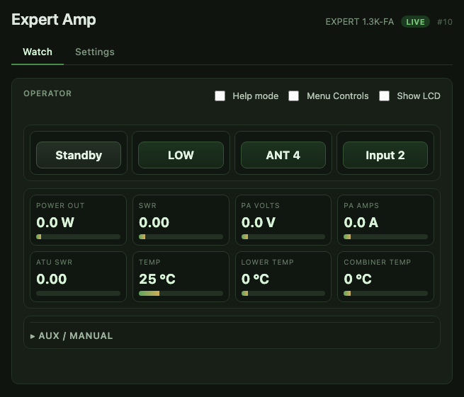
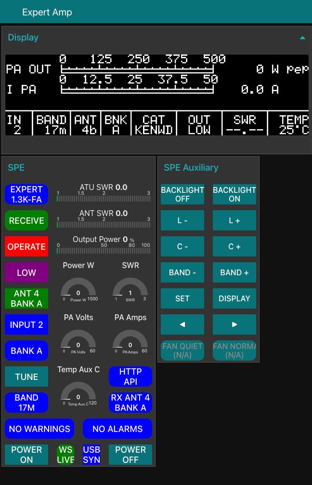

# Expert Amp Server

Expert Amp Server is a small Go server for local-network monitoring and remote control of SPE Expert amplifiers. Run it near the amp, open it from a browser, and get a practical amp panel without needing the vendor Windows app on the operating computer.

It is meant for radio-side computers like a Raspberry Pi, an Apache Labs ANAN G2 internal Raspberry Pi Compute Module, or any small Linux box that can talk to the amp's USB control port.

## What it does

- Mirrors the SPE LCD display in a browser.
- Provides a compact Operator layout for day-to-day amp monitoring and control.
- Gives you working local-network amp controls: operate/standby, power level, antenna, input, tune, display/menu controls, and power-off where supported.
- Exposes a simple documented API for custom integrations, station dashboards, Node-RED flows, and future Thetis-style gauge work.
- Ships a bootstrappable Node-RED dashboard example.
- Includes Raspberry Pi/systemd install notes and a release build helper.

## What you need

- An SPE Expert amplifier. Development and live testing started on an Expert 1.3K-FA, and a user has also reported it running on an Expert 1.5K-FA. The 2K-FA is the same documented family but still needs user confirmation.
- A Raspberry Pi or other small Linux computer near the amp.
- A USB cable from that computer to the amp's USB control port. On SPE Expert amps this is the built-in USB Type-B control connection, not the separate CAT radio serial ports.
- A trusted station LAN so your browser, Node-RED host, logger, or radio-control computer can reach the server.

My tested setup is an Apache Labs ANAN G2 / G2 Ultra with its internal Raspberry Pi Compute Module upgraded and connected directly to the amp's USB control port. That upgrade is not required; any suitable Pi or Linux host near the amplifier should work. If you use Saturn/p2app remotely, see also the related p2app SPE CAT work for feeding band/frequency/TX state to the amp from the radio side.

## Screenshots

### Front Panel



### Operator



### Compact Operator



### Node-RED dashboard example



## Network and safety model

Expert Amp Server is a trusted-LAN station appliance. The default listen address `:8088` intentionally accepts connections from other machines on the local network because the normal setup is a radio-side Pi serving a browser, logger, Node-RED instance, or radio-control PC elsewhere on the same LAN.

Do not expose it directly to the public internet. The HTTP API includes state-changing routes for amp controls, settings, wake, and restart, and it does not currently implement authentication. Use a trusted station LAN, VPN, firewall, or reverse proxy for remote access.

This software controls RF hardware. It is believed to match the documented and observed transport behavior, but you are responsible for deciding whether it is appropriate for your station and amplifier.

## Quick start for local development

```bash
git clone https://github.com/FtlC-ian/expert-amp-server.git
cd expert-amp-server
go run ./cmd/server -addr :8088 -poll-interval 250ms
```

Open <http://localhost:8088/>.

If no serial port is configured, the app starts in setup/fixture mode and the Settings tab lets you enter a persistent config. For real installs, prefer an explicit config path; see the Raspberry Pi install guide.

## API highlights

Canonical API routes live under `/api/v1/...`.

Useful starting points:

```bash
curl http://localhost:8088/healthz
curl http://localhost:8088/api/v1/version
curl http://localhost:8088/api/v1/status
curl http://localhost:8088/api/v1/runtime/snapshot
curl -o screen.png http://localhost:8088/api/v1/display/render.png
```

The app also serves:

- OpenAPI JSON at `/api/v1/openapi.json`
- local API docs at `/api/v1/docs`
- status websocket at `/api/v1/status/ws`
- display invalidation websocket at `/api/v1/display/ws`

## Documentation

Start here:

- [Raspberry Pi install guide](docs/INSTALL_PI.md)
- [Architecture](docs/ARCHITECTURE.md)
- [Protocol notes](docs/PROTOCOL.md)
- [Node-RED integration guide](docs/integrations/node-red.md)
- [Screenshot/reference index](docs/reference/screens/README.md)
- [Release readiness checklist](docs/release/READINESS.md)

## Build release artifacts

```bash
TARGETS="linux/arm64" VERSION="$(git describe --tags --always --dirty)"   packaging/scripts/build-release.sh
```

The release helper injects build metadata into the server binary and copies the sample config plus systemd unit into `dist/`.

## License

MIT. See [LICENSE](LICENSE).
