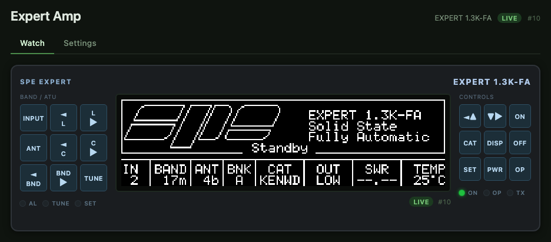
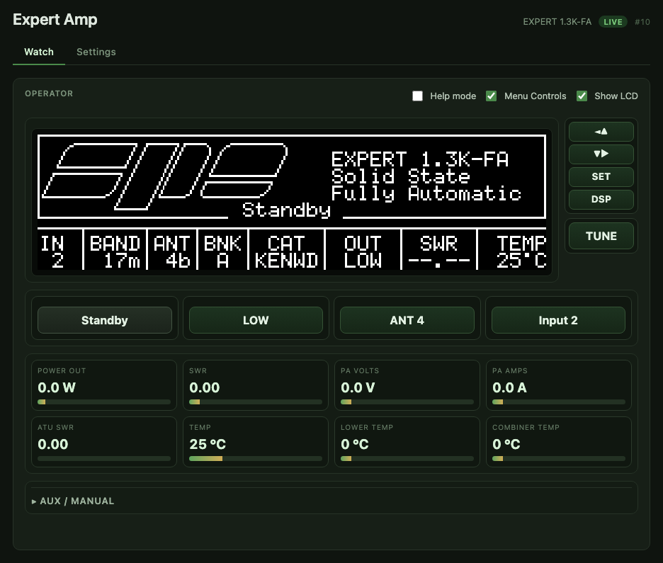
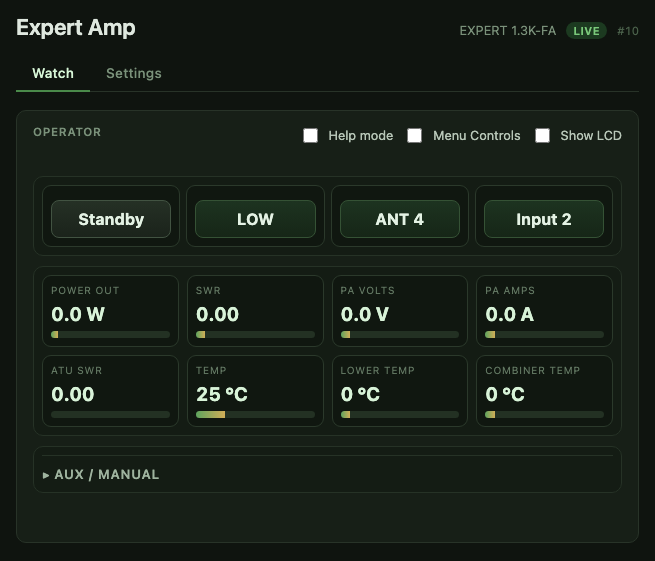
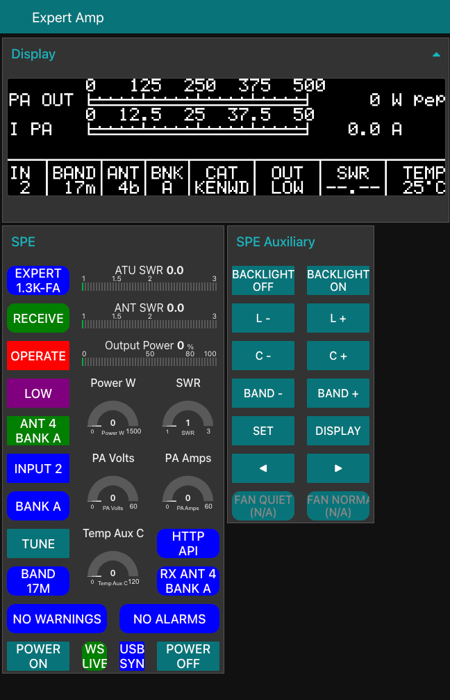

# Expert Amp Server

Expert Amp Server is a small Go server for local-network monitoring and control of SPE Expert amplifiers. Run it near the amp, open it from a browser, and get a practical amp panel without needing the vendor Windows app on the operating computer.

It is meant for radio-side computers like a Raspberry Pi, an Apache Labs ANAN G2 internal Raspberry Pi Compute Module, or any small Linux box that can talk to the amp's built-in USB Type-B control port.

## What it does

- Mirrors the SPE LCD display in a browser.
- Provides Front Panel and compact Operator layouts for day-to-day amp monitoring and control.
- Gives you local-network amp controls: operate/standby, power level, antenna, input, tune, display/menu controls, and power-off where supported.
- Adds display-verified manual and automatic fan cooling with timed Fan Boost, plus optional state-gated overtemperature standby protection.
- Includes a disabled-by-default Menu Debug & Reporting wizard for bounded fan and antenna-bank compatibility tests and sanitized reports.
- Exposes a documented HTTP/WebSocket API for custom integrations, station dashboards, Node-RED flows, and future Thetis-style gauge work.
- Ships a bootstrappable Node-RED dashboard example.
- Includes Raspberry Pi/systemd install notes and a release build helper.

## What you need

- An SPE Expert amplifier. Development and fan-control hardware testing use a First Series Expert 1.3K-FA. Users have also reported the server working on Expert 1.5K-FA and 2K-FA amplifiers; one 2K-FA installation uses the confirmed 57600 troubleshooting fallback.
- A Raspberry Pi or other small Linux computer near the amp.
- A USB cable from that computer to the amp's built-in USB Type-B control port. Do not use the separate CAT radio serial ports for Expert Amp Server.
- A trusted station LAN so your browser, Node-RED host, logger, or radio-control computer can reach the server.

One practical setup is an Apache Labs ANAN G2 / G2 Ultra with its internal Raspberry Pi Compute Module connected directly to the amp over USB. If you use Saturn/p2app remotely, see also the related p2app SPE CAT work for feeding band/frequency/TX state to the amp from the radio side.

## Screenshots

### Front Panel



### Operator



### Compact Operator



### Node-RED dashboard example



## Network and safety model

Expert Amp Server is a trusted-LAN station appliance. The default listen address `:8088` intentionally accepts connections from other machines on the local network because the normal setup is a radio-side Pi serving a browser, logger, Node-RED instance, or radio-control PC elsewhere on the same LAN.

Do not expose it directly to the public internet. The HTTP API includes state-changing routes for amp controls, settings, wake, and restart, and it does not currently implement authentication. Use a trusted station LAN, VPN, firewall, or reverse proxy for remote access.

This software controls RF hardware. It is believed to match the documented and observed transport behavior, but you are responsible for deciding whether it is appropriate for your station and amplifier.

## Quick start for local development

```bash
git clone https://github.com/FtlC-ian/expert-amp-server.git
cd expert-amp-server
go run ./cmd/server -addr :8088 -poll-interval 125ms
```

Open <http://localhost:8088/>.

If no serial port is configured, the app starts in setup/fixture mode and the Settings tab lets you enter a persistent config. For real installs, prefer an explicit config path; see the Raspberry Pi install guide.

## API highlights

Canonical API routes live under `/api/v1/...`.

Useful starting points:

```bash
curl http://localhost:8088/healthz
curl http://localhost:8088/api/v1/version
curl http://localhost:8088/api/v1/status
curl http://localhost:8088/api/v1/runtime/snapshot
curl http://localhost:8088/api/v1/display/text | jq
curl -o screen.png http://localhost:8088/api/v1/display/render.png
```

`GET /api/v1/display/text` provides the current eight-row LCD as fixed-width decoded text, including highlighted ranges and selected text for screen-reader clients. The bundled `display-capture` command can passively record unique display states using GET requests only. See [Display accessibility and passive capture](docs/DISPLAY_ACCESSIBILITY.md) for the response contract and capture workflow.

The app also serves:

- OpenAPI JSON at `/api/v1/openapi.json`
- local API docs at `/api/v1/docs`
- status websocket at `/api/v1/status/ws`
- display invalidation websocket at `/api/v1/display/ws`

## Fan cooling and temperature safety

Manual Fan Boost, Fan Normal, Fan Auto, and Verify controls use a display-verified transaction instead of a blind button macro. The controller temporarily enters STANDBY when necessary, pauses all menu writes during TX, verifies each expected LCD screen, saves the setting, and restores OPERATE only when it owned that transition. A timed Fan Boost begins its timer only after CONTEST mode is verified.

Production fan control is hardware-confirmed only on a First Series Expert 1.3K-FA and requires its model-bound SET-menu topology. Unsupported models stop before SET; an unexpected screen stops the transaction rather than continuing.

Automatic fan cooling is disabled by default. Optional overtemperature standby is separately armed, requires fresh protocol-native OPERATE and RX status, sends one documented OPERATE toggle per hot episode, and never retries, powers off, or wakes the amplifier.

Important upgrade note: the amplifier status protocol sends temperature numbers without a unit. Before enabling temperature monitoring or fan automation, set `amplifierTemperatureUnit` to match the amplifier SET menu (`C` or `F`). All thresholds and API fields ending in `C` remain canonical Celsius.

SPE documents a maximum rate of `115200` with automatic adaptation to lower speeds, so that remains the server default. One field-tested 2K-FA installation only communicated reliably at `57600`; use that as a troubleshooting fallback, not as a model-wide requirement.

## Menu Debug & Reporting

The advanced Menu Debug wizard is disabled by default and intended for supervised compatibility testing. Arming requires the exact acknowledgement, fresh protocol STANDBY/RX, a checksum-valid STANDBY home display, inactive fan control, disarmed overtemperature standby, and an exclusive actuation lease. Each accepted step sends at most one reviewed command and then waits for newer verified display evidence. A serial reconnect invalidates cached model/status/LCD evidence; the replacement session must supply both fresh protocol status and a fresh checksum-valid display before another write.

The reviewed First Series Expert 1.3K-FA profile may propose reversible fan and two-bank A/B tests. An evidence-backed Expert 1.5K-FA Second Series fan profile follows its captured CONFIG-first topology, but remains candidate-only until apply and restoration are physically verified. Unknown models and F-KFA NORMAL/QUIET layouts remain topology-only; QUIET is never treated as high cooling. TX, stale evidence, an unexpected screen, timeout, or safety preemption stops the session fail-closed; the wizard never restores OPERATE or performs blind menu recovery.

Completed `menu-report.v1` reports can be previewed and downloaded locally. Optional upload requires explicit consent and a separately configured HTTPS collector endpoint through `-menu-report-collector-url` or `EXPERT_AMP_MENU_REPORT_COLLECTOR_URL`. Reports exclude network, host, callsign, session-token, and serial-device identity.

## Documentation

Start here:

- [Raspberry Pi install guide](docs/INSTALL_PI.md)
- [Architecture](docs/ARCHITECTURE.md)
- [Display accessibility and passive capture](docs/DISPLAY_ACCESSIBILITY.md)
- [Protocol notes](docs/PROTOCOL.md)
- [Node-RED integration guide](docs/integrations/node-red.md)
- [Screenshot/reference index](docs/reference/screens/README.md)
- [Release readiness checklist](docs/release/READINESS.md)
- [Changelog](CHANGELOG.md)

## Build release artifacts

```bash
TARGETS="linux/arm64" VERSION="$(git describe --tags --always --dirty)" packaging/scripts/build-release.sh
```

The release helper injects build metadata into the server binary and copies the sample config plus systemd unit into `dist/`.

## License

MIT. See [LICENSE](LICENSE).
