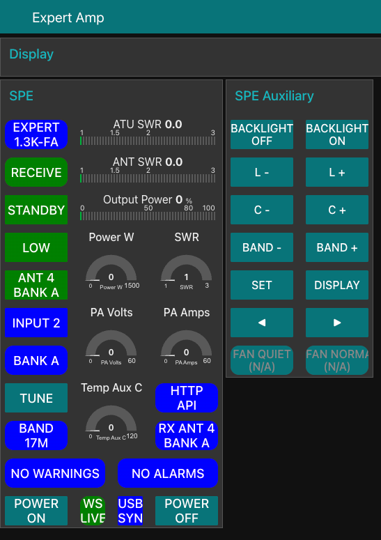

# Node-RED Integration Guide — Expert Amp Server

A project-shareable Node-RED example flow for Expert Amp Server.
This guide covers the example flow included at
`docs/integrations/node-red-example-flow.json`.

---

## Screenshots

### Compact dashboard with display open


### Compact dashboard with display collapsed



## Overview

The example flow is a **dashboard-fidelity port** of the WB2WGH SPE Linear flow (V1.3).
It preserves the original layout, CSS, button styles, gauge and level widgets, and
color-state logic, while rewiring all reads and writes from serial to the Expert Amp
Server `/api/v1` API. Live status is websocket-first via `/api/v1/status/ws`, with
HTTP polling retained as an automatic fallback path.

Thanks to **Ron, WB2WGH**, for publishing the original SPE Linear Node-RED flow that
this version is based on.
Reference announcement for the version used here:
<https://groups.io/g/nodered-hamradio/topic/expert_spe_linear_flow/116437717>

**Required Node-RED packages:**
- `node-red-dashboard`
- `node-red-contrib-ui-level`
- core Node-RED websocket nodes (built in; no extra install)

Install via the Node-RED palette manager or:

```bash
cd ~/.node-red
npm install node-red-dashboard node-red-contrib-ui-level
```

---

## What the flow does

### Live status + fallback

| Path | Mode | Interval / behavior | Endpoint |
|---|---|---|---|
| Primary live status | WebSocket | Connect once, receive initial snapshot + change-driven updates | `GET /api/v1/status/ws` |
| Fallback status | HTTP poll | Every 5 s only while websocket is down | `GET /api/v1/status` |
| Alarms | HTTP poll | Every 10 s | `GET /api/v1/alarms` |

### Dashboard groups (tab: "Expert Amp")

| Group | Width | Purpose |
|---|---|---|
| Display | 12 | Expert Amp display render image (`/api/v1/display/render.png`) |
| SPE | 6 | Main telemetry tiles + gauges + levels |
| SPE Auxiliary | 4 | Front-panel control buttons |

### SPE group tiles (order matches original WB2WGH flow exactly)

| Order | Tile | Type | Width | Notes |
|---|---|---|---|---|
| 1 | Model | status tile | 2 | Read-only; shows model name |
| 2 | ATU SWR | ui_level | 4 | Driven from `status.swr` |
| 3 | RX/TX | status tile | 2 | Green = Receive, Red/Yellow = Transmit |
| 4 | ANT SWR | ui_level | 4 | Driven from `status.antennaSwr`, falling back to `status.swr` |
| 5 | Mode | action tile | 2 | Green = Standby, Red = Operate; click sends `operate` |
| 6 | Output Power | ui_level | 4 | Driven from `status.powerWatts` (scaled 0–100%) when present |
| 7 | PWR Level | status tile | 2 | Color-coded by level + mode state |
| 8 | Power W gauge | ui_gauge | 2×2 | 0–1500 W |
| 9 | SWR gauge | ui_gauge | 2×2 | 1–3 |
| 10 | Antenna | action tile | 2 | Click cycles antenna; shows `status.antenna` |
| 11 | Input | action tile | 2 | Click cycles input; shows `status.input` |
| 12 | PA Volts gauge | ui_gauge | 2×2 | 0–60 V, driven from `status.paSupplyVoltage` |
| 13 | PA Amps gauge | ui_gauge | 2×2 | 0–60 A, driven from `status.paCurrent` |
| 14 | Bank | status tile | 2 | Read-only; shows `antennaBank` (bank select not in current API) |
| 15 | Tune | action tile | 2 | Static green; sends `tune` |
| 16 | Temp Lower / Comb gauge | ui_gauge | 2×2 | 0–120 °C, prefers lower/combiner status fields and falls back to upper temp |
| 17 | Logging State | badge | 2 | Shows "HTTP API" (file logging removed) |
| 18 | Band | status tile | 2 | Read-only; shows `status.band` |
| 19 | RX Antenna | status tile | 2 | Read-only; shows antenna + bank |
| 20 | Warnings | status tile | 3 | Blue = No Warnings, Orange = Warning present |
| 21 | Alarms | status tile | 3 | Blue = No Alarms, Red = Alarm active |
| 22 | Power On | orange button | 2 | Calls experimental `POST /api/v1/actions/wake` |
| 23 | USB Status | status tile | 1 | Green = websocket live, Orange = HTTP fallback, Red = API error |
| 24 | USB Sync | action tile | 1 | Triggers immediate HTTP refresh |
| 25 | Power Off | orange button | 2 | Sends `off` action |

### SPE Auxiliary group buttons (order matches original exactly)

| Order | Button | Action sent |
|---|---|---|
| 1 | Backlight Off | `display` (closest available — cycles display page) |
| 2 | Backlight On | `display` |
| 3 | L - | `l-` |
| 4 | L + | `l+` |
| 5 | C - | `c-` |
| 6 | C + | `c+` |
| 7 | Band - | `band-` |
| 8 | Band + | `band+` |
| 9 | Set | `set` |
| 10 | Display | `display` |
| 11 | Left Arrow | `left` |
| 12 | Right Arrow | `right` |
| 13 | Fan Quiet / Toggle | disabled (not in current API) |
| 14 | Fan Normal / N/A | disabled (not in current API) |

---

## Configuration

Edit the **"Set expertAmpBaseUrl"** function node to point at your server:

```js
const baseUrl = 'http://192.168.1.100:8088';  // your host
```

Default is `http://localhost:8088`.

Clean-import gotcha: the three `ui_level` nodes require their full `node-red-contrib-ui-level` configuration. If Node-RED logs `Cannot read properties of undefined (reading 'indexOf')` from `ui-level.js`, the flow was imported from a damaged or hand-edited export with incomplete level-node fields. Re-import the checked-in flow and verify `node-red-contrib-ui-level` is installed.

Also update the **websocket-client** config node if your server is not local:

```text
ws://192.168.1.100:8088/api/v1/status/ws
```

Use `wss://...` if your deployment is TLS-terminated.

---

## Button actions

All buttons POST to `POST /api/v1/actions/button` with `{"name": "<action>"}`.

**Currently supported actions** (safe per transport/buttons.go):

```
set, left, right, up, down, display
input, antenna, band-, band+
l-, l+, c-, c+
tune, off, power, operate, cat
```

**Intentionally blocked** (not in current command table or not safely confirmed):

```
back, on, standby
```

Fan mode actions (`fan-quiet`, `fan-normal`) are not in the current action table.
The Fan buttons are shown disabled in the dashboard.

---

## Preserved vs changed from original WB2WGH flow

### Preserved

- **SPE Master CSS** — all original classes intact:
  `SPEvibrate`, `SPEfilled`, `SPEtouched`, `SPErounded`, `SPEhoverblue`, `SPEhoverred`
- **Group layout** — SPE (width=6) and SPE Auxiliary (width=4) on one dashboard tab
- **All 25 SPE tile names and order** — identical to the original
- **All 14 SPE Auxiliary button names and order** — identical to the original
- **ui_gauge ×5** — same positions (orders 8, 9, 12, 13, 16) and 2×2 size
- **ui_level ×3** — ATU SWR, ANT SWR, Output Power at orders 2, 4, 6
- **Color-state logic** — RX/TX, Mode, PWR Level, Warnings, Alarms use same gradient rules
- **Tune static-green button** — preserved
- **Power On / Power Off orange buttons** with `SPEhoverred` hover style

### Changed

| Original | This flow | Reason |
|---|---|---|
| Serial port nodes | Websocket-first status via `/api/v1/status/ws` with HTTP fallback to `/api/v1/status` | No direct serial in Node-RED |
| USB status = physical USB | USB Status = websocket/API connectivity state | Serial path removed |
| USB Sync = serial resync | USB Sync = immediate HTTP refresh | Rewired to API transport |
| Logging State = CSV file | Logging State shows "HTTP API" | File logging not applicable |
| Gauge labels: Volts / Amps | Gauge labels now use promoted API fields for PA volts and PA amps | Driven from `/api/v1/status` instead of hidden note strings |
| Bank select buttons | Bank tile is read-only | Bank select not in current API |
| Fan Quiet / Fan Normal | Shown as disabled | Not in current action table |
| Backlight On/Off | Mapped to `display` action | No backlight command in current API |
| Power On (Python script) | Calls experimental `POST /api/v1/actions/wake` | Experimental HTTP wake action |
| History charts / fidelity notes | Removed from the example | They added clutter and unnecessary dashboard weight for the current use case |

### Added (not in original)

- Display render image at top (Expert Amp Server feature, per project direction)

---

## Smoke-test checklist

Before declaring the flow healthy:

1. **Server reachable** — deploy, open Node-RED debug panel, confirm base URL message on startup
2. **Websocket/fallback status works** — confirm tiles update. USB Status should show green `WS Live` when websocket messages are flowing, or orange `HTTP Fallback` when the fallback poll path is active.
3. **Fallback recovery works** — interrupt websocket/server access; USB Status should turn red on API errors, then return to `WS Live` or `HTTP Fallback` after connectivity is restored.
4. **Tiles update** — open Node-RED Dashboard (`/ui`), confirm SPE tiles show values
5. **Display render loads** — Display group shows amp display image (may be blank in fixture mode)
6. **Safe button action works** — click Set or Display button; check debug tab for `OK: set` / `OK: display`
7. **Alarm tile updates** — alarms endpoint stub returns empty; Warnings + Alarms should show blue `No Alarms / No Warnings`
8. **Error handling** — stop the Expert Amp Server completely; USB Status tile should turn red after fallback requests fail

---

## Required packages

| Package | Purpose |
|---|---|
| `node-red-dashboard` | Core dashboard nodes like `ui_template`, `ui_gauge`, `ui_chart`, `ui_group`, `ui_tab` |
| `node-red-contrib-ui-level` | Provides the `ui_level` nodes used for ATU SWR, ANT SWR, and Output Power bars |

If import complains about unrecognized `ui_level` node types, this second package is the missing dependency.

The websocket nodes used here are part of core Node-RED; no extra websocket package is required.

---

## Notes

- Websocket-first design for live status, with automatic HTTP fallback so the dashboard does not go stale on disconnect.
- Flow works against the canonical `/api/v1` surface. No direct serial wiring in Node-RED.
- `/api/v1/status/ws` carries the same canonical status model as `GET /api/v1/status` and is the preferred live feed.
- `/api/v1/status` remains the fallback polling route and the authoritative machine-readable status surface for reconnect gaps and manual refreshes. It uses the vendor-documented status poll/response shape where available, with display-derived values only as fallback. Protocol-backed fields now include raw-plus-decoded band and warning/alarm fields (`bandCode`/`bandText`, `warningCode`/`warningsText`, `alarmCode`/`alarmsText`), the raw `atuStatusCode`, and first-class meter fields such as `antennaSwr`, `paSupplyVoltage`, `paCurrent`, `temperatureLowerC`, and `temperatureCombinerC` when the amp model reports them.
- The checked-in example intentionally matches the cleaned-up working dashboard: no History group, no extra chart panels, and a tighter display block.
- All node IDs are stable across re-imports (MD5 of seed name). Existing nodes will update on re-import.
- The flow is project-clean: no Ian-specific hostnames, entity IDs, or HA-specific details.
